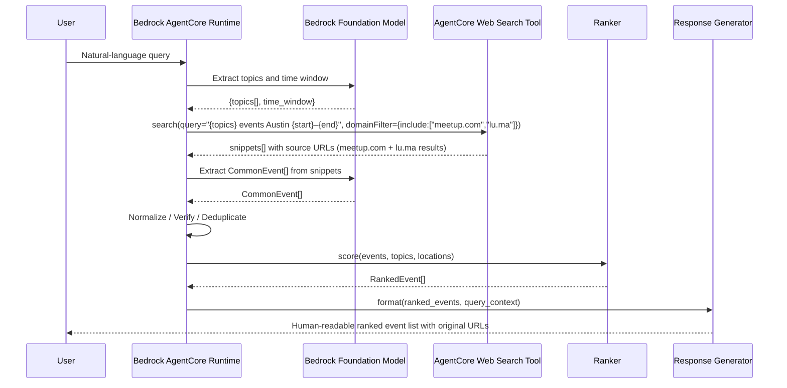
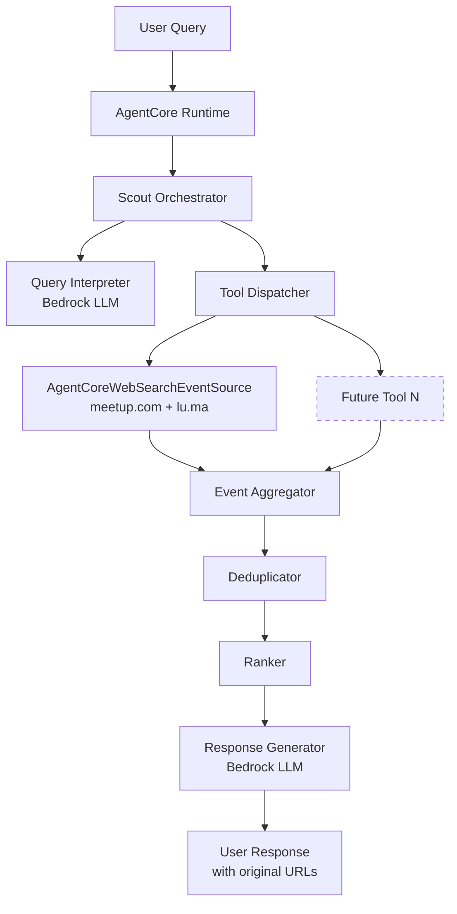

# Design Document: Community Scout Austin

## Overview

The AI Community Scout is an agentic application that helps technology professionals discover upcoming meetups and community events. A user submits a natural-language query describing topics of interest and an optional time window. The Scout interprets the query, uses the Amazon Bedrock AgentCore Web Search Tool — domain-filtered to meetup.com and lu.ma — to retrieve publicly indexed event pages (v0.1; extensible by expanding the domain filter list), extracts event data from the returned snippets, normalizes them into a Common Event Model, deduplicates, ranks by relevance, and returns a readable, hyperlinked list — never fabricating any event, date, or URL.

**Key design goals:**
- **Factual accuracy**: Every event in the response must originate from a live event-source tool. The LLM is responsible only for language understanding and response formatting, never for generating event facts.
- **Modularity**: Each event source is an independently deployable tool with a uniform interface, allowing new sources to be added without touching core Scout logic.
- **Managed runtime**: The Scout runs on Amazon Bedrock AgentCore Runtime, eliminating custom orchestration infrastructure.
- **Deterministic ranking**: Relevance scores are computed by a pure function (not the LLM) using a fixed weighted formula, ensuring results are reproducible and auditable.

---

## Architecture

### High-Level Flow



### Component Map



### Technology Stack

| Layer | Choice | Rationale |
|---|---|---|
| Agent Runtime | Amazon Bedrock AgentCore Runtime | Managed serverless compute, session isolation, built-in observability, no custom infra |
| Agent Framework | Strands Agents | AWS-native, lightweight tool loop, compatible with AgentCore SDK `@app.entrypoint` pattern |
| Foundation Model | Amazon Bedrock (configurable model ID) | Query interpretation and response formatting; model selected at deploy time via `BEDROCK_MODEL_ID` environment variable; defaults to `us.anthropic.claude-sonnet-4-20250514` |
| AgentCore Web Search | Amazon Bedrock AgentCore Web Search Tool (MCP) | Fully managed web search over Amazon's own index. No API keys or third-party credentials. Domain-filtered to meetup.com and lu.ma. Returns snippets + source URLs. $7/1K queries. |
| Event Sources | meetup.com + lu.ma (public indexed pages) | Both platforms' public event pages are indexed and retrievable via the Web Search Tool domain filter. No platform-specific API or credential required. |
| Language | Python 3.12 | Strong AWS SDK support, Strands SDK availability, rich data-processing ecosystem |
| Testing | pytest + Hypothesis | Unit + property-based testing |

---

### Configuration

The Scout reads all tuneable values from environment variables at startup. No configuration is hard-coded in application logic.

| Environment Variable | Required | Default | Description |
|---|---|---|---|
| `BEDROCK_MODEL_ID` | No | `us.anthropic.claude-sonnet-4-20250514` | Amazon Bedrock model ID for query interpretation and response formatting. Any Bedrock model ID supporting tool use may be substituted. |

**Behaviour:**
- `BEDROCK_MODEL_ID` is read at handler invocation time; changing it does not require restarting the runtime.
- No API keys, OAuth credentials, or external secrets are required for v0.1. The AgentCore Web Search Tool is a managed AWS service invoked within the AgentCore runtime — no outbound credentials leave the AWS environment.

---

## Components and Interfaces

### 1. Scout Orchestrator

The top-level entry point, hosted as a Bedrock AgentCore Runtime. It wraps a Strands `Agent` that is given the event-source tools as callable tool definitions.

```python
import os
from bedrock_agentcore import BedrockAgentCoreApp
from strands import Agent
from strands.tools.mcp import MCPClient
from tools import agentcore_web_search_event_source

app = BedrockAgentCoreApp()

DEFAULT_MODEL_ID = "us.anthropic.claude-sonnet-4-20250514"

SYSTEM_PROMPT = """
You are the Community Scout. Given a user query:
1. Extract topics and optional time window. The location is fixed to Austin, Texas for v0.1.
2. Invoke the AgentCoreWebSearchEventSource with the extracted topics, Austin as location, and the time window.
3. Extract structured event data (title, date, city, URL) from the returned snippets.
4. NEVER invent, infer, or fabricate any event title, date, location, or URL not present in the search results.
5. If no events are found, say so clearly.
"""

@app.entrypoint
async def handler(request):
    prompt = request.get("prompt")
    model_id = os.environ.get("BEDROCK_MODEL_ID", DEFAULT_MODEL_ID)
    agent = Agent(
        model=model_id,
        system_prompt=SYSTEM_PROMPT,
        tools=[agentcore_web_search_event_source]
    )
    async for event in agent.stream_async(prompt):
        yield event
```

**Responsibilities:**
- Receive the user query
- Drive the LLM tool-use loop (interpret → dispatch tools → deduplicate → rank → respond)
- Enforce the 120-second session timeout (enforced at AgentCore level)
- Surface errors from failed tools without aborting the session

### 2. Query Interpreter

Implemented by the Bedrock foundation model within the Scout's system prompt context. Extracts structured intent from the natural-language query.

**Output schema** (returned as structured JSON embedded in the LLM's reasoning):
```json
{
  "topics": ["Agentic AI", "AWS"],
  "location": "Austin, Texas"  // fixed for v0.1
  "time_window": {
    "start_date": "2025-08-01",
    "end_date": "2025-10-30"
  }
}
```

**Rules enforced via system prompt:**
- If no topics can be extracted, request clarification and do not invoke any tools.
- Default time window: 90 calendar days from today.
- Reject queries with more than 10 topics.
- Reject empty/whitespace-only queries.

### 3. Event Source Tool Interface

All event source tools conform to a single Python callable signature:

```python
from typing import Protocol, List
from models import CommonEvent, ToolError

class EventSourceTool(Protocol):
    def __call__(
        self,
        topics: List[str],      # 1–10 topics, each 1–200 chars
        location: str,          # Single city, 1–200 chars
        start_date: str,        # ISO 8601 date string
        end_date: str,          # ISO 8601 date string
    ) -> List[CommonEvent] | ToolError:
        ...
```

Each tool is decorated with `@tool` (Strands) so the LLM can invoke it by name with typed parameters. The tool must return either a list of `CommonEvent` records or a `ToolError`. It must respond within 10 seconds.

### 4. AgentCoreWebSearchEventSource

Implements the `EventSourceTool` Protocol. Internally invokes the Amazon Bedrock AgentCore Web Search Tool via MCP with a domain filter targeting meetup.com and lu.ma simultaneously. All Web Search Tool configuration — gateway URL, domain filter, query construction, date filter, and snippet parsing — is isolated within this class.

**Web Search Tool invocation:**
```python
{
  "method": "tools/call",
  "params": {
    "name": "WebSearch",
    "arguments": {
      "query": "{topics} events in Austin Texas {start_date} to {end_date}",
      "filters": {
        "domainFilter": {
          "include": ["meetup.com", "lu.ma"]
        }
      }
    }
  }
}
```

**Time window handling:** The event time window is embedded in the query string, not passed as a `publishedDateFilter`. The publication date of a web page is not the same as the date of an event it describes. After the Web Search Tool returns snippets, `AgentCoreWebSearchEventSource` post-filters the extracted `CommonEvent` records by verified event start date, discarding any record whose start date is outside `[start_date, end_date]`.

**What the Web Search Tool returns:**
Each result contains: `title`, `url`, `snippet` (semantically extracted passage), `publishedDate`. The LLM extracts structured event fields (title, event date, city, Event_URL) from these snippets using only facts explicitly stated in the snippet text or derivable from the source URL (e.g., platform name from domain). If any required field is absent or ambiguous in the evidence, the record is excluded — no inference or substitution is permitted.

**Authentication:** None required from the application. The AgentCore Web Search Tool is a managed AWS service — no external API keys, Bearer tokens, or third-party credentials leave the AWS environment.

**Source coverage:** meetup.com and lu.ma public event pages are both included in Amazon's web index and returned together in a single search call. The domain filter ensures no results from other sources are included.

**Extensibility:** To add more event sources, add their domains to the `domainFilter.include` list inside `AgentCoreWebSearchEventSource`. No other component needs to change.

**Error handling:** Returns `ToolError(tool_name='AgentCoreWebSearchEventSource', reason=...)` on Web Search Tool error or timeout; no partial records returned.

**Pricing:** The AgentCore Web Search Tool is priced at $7 per 1,000 queries. New AWS accounts receive Free Tier credits.

### 5. Event Aggregator

After all tool invocations complete, the Scout collects all returned `CommonEvent` lists and flattens them into a single list. Any `ToolError` entries are collected separately and surfaced in the response footer.

### 6. Deduplicator

Pure Python function with no external dependencies. Detects duplicate events across sources and retains the highest-confidence record.

**Algorithm:**
1. Normalize each event's title (strip leading/trailing whitespace, lowercase), start date (date portion only), and city (strip + lowercase).
2. Group events by `(normalized_title, start_date, normalized_city)`.
3. Within each group, sort by `match_confidence DESC, source_invocation_order ASC`.
4. Retain the first record in each group; discard the rest.

### 7. Ranker

Pure Python function implementing the deterministic weighted formula:

```
relevance_score = topic_score + recency_score

topic_score   = (matched_topics / total_topics) * 80
recency_score = max(0, 20 * (1 - days_until_event / 365))  # 0 if > 365 days away
```

Where:
- `matched_topics` = count of query topics that appear (case-insensitive substring) in event title or description.
- `days_until_event` = calendar days between today and event start date.
- Location is not scored in v0.1 because every accepted event is already in Austin, Texas.
- Final score is clamped to [0, 100].

**Tie-breaking:** Events with equal scores are ordered by ascending start date.

If no topics were extracted, all events receive a score of 0 and are ordered by start date.

### 8. Response Generator

Implemented by the Bedrock foundation model using a structured formatting prompt. Receives the ranked `CommonEvent` list and query context.

**Rules enforced via prompt:**
- Display fields: event title, source platform, city, start date (YYYY-MM-DD), Event_URL as a markdown hyperlink.
- Missing required display fields render as "N/A".
- Total event count (after deduplication) appears at the top.
- Events are listed sequentially; location grouping is not applicable in v0.1 (fixed to Austin, Texas).
- When no events are found, the response explains why and suggests broadening the query.
- Event URLs must not be altered, summarized, or omitted.

---

## Data Models

### CommonEvent

```python
from dataclasses import dataclass
from typing import Optional

@dataclass
class CommonEvent:
    # Required fields (must be non-null and non-empty)
    title: str                  # Event title
    start_datetime: str         # ISO 8601 UTC, e.g. "2025-09-15T18:00:00Z"
    city: str                   # City (Austin, Texas for v0.1)
    source_platform: str        # "Meetup" | "Luma" | ... (derived from source URL domain)
    event_url: str              # Unmodified source URL

    # Optional fields
    description: Optional[str]  # Event description or null
    end_datetime: Optional[str] # ISO 8601 UTC or null
    location_name: Optional[str] # Venue name or "Online" or null

    # Internal fields
    match_confidence: float     # 0.0–1.0, default 0.0 if not provided by source
    source_invocation_order: int  # 0-based index of tool invocation
```

**Invariants:**
- Required fields must be non-empty strings.
- Optional fields may be null.
- `start_datetime` and `end_datetime` (when non-null) must be ISO 8601 UTC strings ending in `Z`.
- `event_url` is byte-for-byte immutable after population by the originating tool.
- Deterministic normalizations permitted: ISO 8601 datetime conversion, whitespace normalization, source platform name derivation from URL domain.

### RankedEvent

```python
@dataclass
class RankedEvent:
    event: CommonEvent
    relevance_score: float      # 0.0–100.0
```

### ToolError

```python
@dataclass
class ToolError:
    tool_name: str
    reason: str
```

### QueryContext

```python
@dataclass
class QueryContext:
    topics: list[str]           # 1–10 items
    location: str               # Fixed to "Austin, Texas" in v0.1
    start_date: str             # ISO 8601 date
    end_date: str               # ISO 8601 date
```

### Tool Interface Contract

```python
# Input parameters (passed as JSON by AgentCore tool invocation)
{
    "topics": ["string"],       # required, 1–10 items
    "location": "string",       # fixed to "Austin, Texas" in v0.1
    "start_date": "YYYY-MM-DD", # required
    "end_date": "YYYY-MM-DD"    # required
}

# Success output
[CommonEvent, ...]

# Error output
{"error": true, "tool_name": "MeetupTool", "reason": "HTTP 503 from Meetup API"}
```

---

## Correctness Properties

*A property is a characteristic or behavior that should hold true across all valid executions of a system — essentially, a formal statement about what the system should do. Properties serve as the bridge between human-readable specifications and machine-verifiable correctness guarantees.*

### Property 1: Relevance Score Formula and Bounds

*For any* `CommonEvent` and `QueryContext`, the `relevance_score` computed by the Ranker SHALL equal `topic_score + recency_score` where `topic_score` is in [0, 80] and `recency_score` is in [0, 20], the result is clamped to [0, 100], and the final score lies in the closed interval [0, 100]. Location is not a scoring component in v0.1.

**Validates: Requirements 7.1, 7.2**

---

### Property 2: Topic Score Monotonicity

*For any* two events A and B evaluated against the same `QueryContext`, if event A matches strictly more topics from the query than event B, then the Ranker SHALL assign event A a strictly higher `relevance_score` than event B, assuming recency is equal.

**Validates: Requirements 7.2, 7.3, 11.3**

---

### Property 3: Deduplication Retains Exactly One Record Per Group

*For any* list of `CommonEvent` records (possibly containing duplicates), after deduplication the output list SHALL contain exactly one record per unique `(normalized_title, start_date, normalized_city)` group, where normalization strips leading/trailing whitespace and applies case-insensitive comparison.

**Validates: Requirements 6.1**

---

### Property 4: Deduplication Retains Highest-Confidence Record

*For any* group of duplicate events (same normalized title, start date, and city) with varying `match_confidence` values (treating absent confidence as 0), the deduplicator SHALL retain the record with the highest `match_confidence`, and when confidence values are equal, the record from the earliest-invoked tool.

**Validates: Requirements 6.2, 6.3, 6.4**

---

### Property 5: CommonEvent URL Immutability

*For any* `CommonEvent` returned by an Event_Source_Tool and passed through deduplication, ranking, and response formatting, the `event_url` field in the output SHALL be byte-for-byte identical to the value originally set by the originating tool — no truncation, encoding, or modification.

**Validates: Requirements 5.4, 8.5, 9.2**

---

### Property 6: Normalization Preserves and Validates Required Fields

*For any* raw event record from a source platform: (a) if the record contains non-empty values for all required `CommonEvent` fields, the normalizer SHALL produce a `CommonEvent` with all required fields non-empty and non-null; (b) if the record is missing any required field, the normalizer SHALL exclude it from the output.

**Validates: Requirements 5.1, 5.2, 5.5**

---

### Property 7: ISO 8601 UTC Datetime Format

*For any* `CommonEvent` produced by an Event_Source_Tool, `start_datetime` SHALL match the regex `^\d{4}-\d{2}-\d{2}T\d{2}:\d{2}:\d{2}Z$`, and `end_datetime`, when non-null, SHALL match the same pattern.

**Validates: Requirements 5.6**

---

### Property 8: Ranked Output is Sorted Descending by Score then Start Date

*For any* list of `RankedEvent` records produced by the Ranker, the list SHALL be sorted in non-increasing order of `relevance_score`, and for any two events with equal `relevance_score`, the event with the earlier `start_datetime` SHALL appear first.

**Validates: Requirements 7.4, 7.5**

---

### Property 9: Time Window Filtering

*For any* `CommonEvent` included in a tool's output, the event's `start_datetime` date component SHALL fall within the inclusive range `[start_date, end_date]` specified in the tool invocation parameters.

**Validates: Requirements 3.2, 4.2**

---

### Property 10: Tool Failure Containment

*For any* set of N event-source tool invocations where k tools fail (0 < k < N), the Scout SHALL include all events from the (N − k) successful tools in the response and SHALL record exactly k error entries — one per failed tool — without aborting the session.

**Validates: Requirements 2.5, 11.5**

---

### Property 11: Tool Result Aggregation Completeness

*For any* set of Event_Source_Tool invocations where all invocations succeed, the pre-deduplication event set collected by the Scout SHALL equal the union of all `CommonEvent` lists returned by all tools.

**Validates: Requirements 2.3**

---

## Error Handling

### Tool Failure

When an event-source tool times out (>10 s) or returns an HTTP error:
- The tool returns a `ToolError` record (not an exception).
- The Scout logs the tool name and failure reason.
- The Scout continues processing results from remaining tools.
- The final response includes a note at the bottom identifying which tools failed and why.
- If all tools fail, the Scout returns an error message rather than an empty results list.

### Query Validation Failures

| Condition | Behavior |
|---|---|
| Empty or whitespace-only query | Return error before any extraction or tool call |
| Cannot extract topic | Return clarification message asking the user to specify a topic |
| More than 10 topics | Reject query with error message before invoking any tool |
| Time window > 5 years | Reject the specified range; use default 90-day window and inform user |

### Missing Required Event Fields

If a source platform omits a required `CommonEvent` field for a specific event:
- The tool excludes that event record from the output.
- The tool logs an internal record: `{platform, event_identifier, missing_field}`.
- Skipped events are never surfaced to the user.

### AgentCore Session Failure

If the AgentCore runtime fails to establish or maintain the session:
- Return an error message to the user.
- Do not return partial results.

---

## Testing Strategy

### Unit Tests (pytest)

Unit tests focus on specific examples, edge cases, and integration points between components. Avoid over-testing inputs that are already covered by property-based tests.

**Deduplicator:**
- Two identical events from different sources → retain the higher-confidence record.
- Duplicates with equal confidence → retain the record from the earlier-invoked tool.
- No duplicates in input → output equals input.
- Title comparison is case-insensitive and whitespace-stripped.

**Ranker:**
- Event matching all topics, starting tomorrow → score near 100.
- Event matching no topics, starting in 400 days → score = 0.
- Event matching 1 of 2 topics, 30 days away → computed expected value.
- Zero topics extracted → all events score 0.
- Two events with equal scores → ordered by ascending start date.

**Query Validation:**
- Empty string → error, no tool invocation.
- Whitespace-only string → error, no tool invocation.
- Query with no discernible topic → clarification message for missing topic.
- Query with 11 topics → rejection error.

**CommonEvent Normalization:**
- Event with all required fields → valid `CommonEvent`.
- Event missing a required field → excluded from output, logged.
- Optional `end_datetime` absent → field set to `null`.
- `start_datetime` converted to UTC ISO 8601 `Z` suffix.

**Response Generator:**
- Missing display field → rendered as "N/A".
- Zero events → user-facing "no events found" message with suggestions.
- Event URLs appear unmodified as markdown hyperlinks.

### Property-Based Tests (pytest + Hypothesis)

Each test runs a minimum of 100 iterations. Tests are tagged with the design property they validate.

**Tag format:** `# Feature: community-scout-austin, Property {N}: {property_text}`

**Property 1 — Relevance Score Formula and Bounds:**
Generate random `CommonEvent` instances and `QueryContext` values. Assert that `Ranker.score(event, context)` equals the manually computed `topic_score + location_score + recency_score`, is clamped to [0, 100], and lies in [0, 100].
`# Feature: community-scout-austin, Property 1: score = clamped(topic_score + recency_score), topic in [0,80], recency in [0,20], result in [0,100]`

**Property 2 — Topic Score Monotonicity:**
Generate a `QueryContext` with N topics and pairs of events where event A matches k+1 topics and event B matches k topics (all other components held equal). Assert `score(A) > score(B)` for all such pairs.
`# Feature: community-scout-austin, Property 2: matching more topics gives strictly higher score`

**Property 3 — Deduplication Retains One Record Per Group:**
Generate random lists of events including fabricated duplicates. Assert output contains exactly one record per unique `(normalized_title, start_date, normalized_city)` group.
`# Feature: community-scout-austin, Property 3: exactly one record per dedup group`

**Property 4 — Deduplication Retains Highest-Confidence Record:**
Generate groups of duplicate events with random `match_confidence` values (including 0). Assert the retained record has the maximum confidence, with ties broken by source invocation order.
`# Feature: community-scout-austin, Property 4: dedup retains highest-confidence record`

**Property 5 — URL Immutability Round-Trip:**
Generate a list of events, run them through deduplication and ranking. Assert all `event_url` values in the output are byte-for-byte identical to the originating tool's output.
`# Feature: community-scout-austin, Property 5: event_url is unchanged through the pipeline`

**Property 6 — Normalization Preserves and Validates Required Fields:**
Generate raw platform event dicts: (a) with all required fields populated — assert normalized output has all required fields non-empty; (b) with one required field randomly removed — assert the event is excluded from output.
`# Feature: community-scout-austin, Property 6: normalization preserves required fields and excludes incomplete records`

**Property 7 — ISO 8601 UTC Format:**
Generate valid raw event records. Assert `start_datetime` (and non-null `end_datetime`) in normalized output matches `^\d{4}-\d{2}-\d{2}T\d{2}:\d{2}:\d{2}Z$`.
`# Feature: community-scout-austin, Property 7: datetimes are ISO 8601 UTC`

**Property 8 — Ranked Output is Sorted:**
Generate a list of events with random scores. Assert the Ranker's output is non-increasingly sorted by `relevance_score`, with ties broken by ascending `start_datetime`.
`# Feature: community-scout-austin, Property 8: ranked output sorted by score desc, start date asc on tie`

**Property 9 — Time Window Filtering:**
Generate tool invocation parameters and raw platform responses with varied event dates. Assert every `CommonEvent` in the filtered output has `start_datetime.date` in `[start_date, end_date]`.
`# Feature: community-scout-austin, Property 9: all output events are within the requested time window`

**Property 10 — Tool Failure Containment:**
Generate a set of N mock tools where k randomly selected tools raise errors. Assert the Scout's result contains the union of events from the (N − k) successful tools and exactly k error entries.
`# Feature: community-scout-austin, Property 10: failed tools are contained without aborting the session`

**Property 11 — Multi-Location Aggregation Completeness:**
Generate N locations with random mock tool responses. Assert the pre-deduplication event set equals the union of all tool responses across all locations.
`# Feature: community-scout-austin, Property 11: all events from all locations are aggregated`

### Integration Tests

Targeting behavior that requires the real or mocked AgentCore/Bedrock stack. Run with 1–3 representative examples.

- End-to-end: submit a known query against mocked AgentCoreWebSearchEventSource responses (mocked Web Search Tool snippets for meetup.com and lu.ma events); assert ranked output contains correct events in expected order with unmodified source URLs.
- AgentCore tool timeout: mock the Web Search Tool to time out; assert the Scout returns an error note without partial results and does not raise an exception.
- Zero results: mock the Web Search Tool to return empty results; assert the user receives the "no events found" message with a count of 0 and suggestions.

### Test Pyramid Summary

```
       /\
      /  \   Integration (few, slow, realistic)
     /----\
    /      \  Unit tests (specific examples & edge cases)
   /--------\
  /          \ Property-based tests (universal invariants, 100+ iterations each)
 /------------\
```
