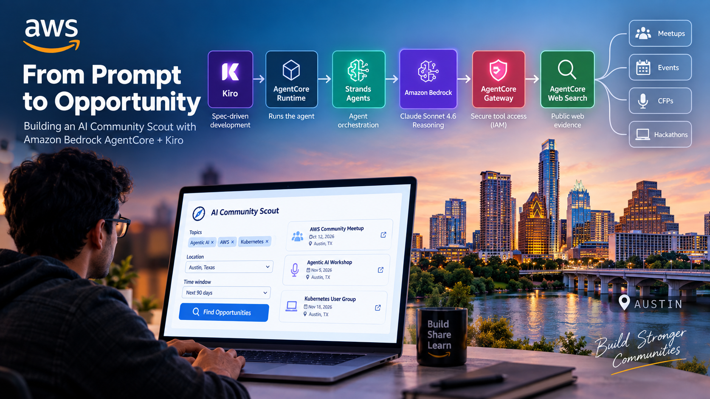
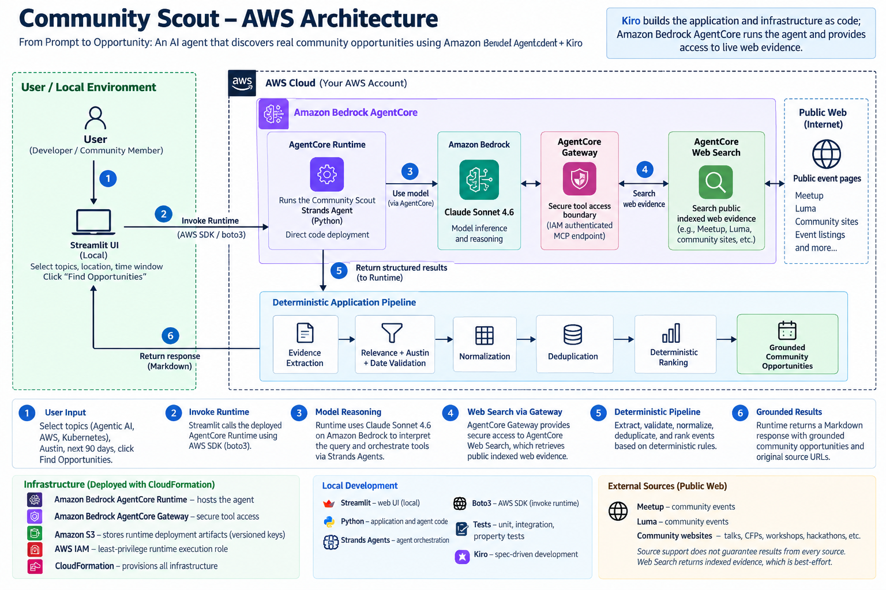
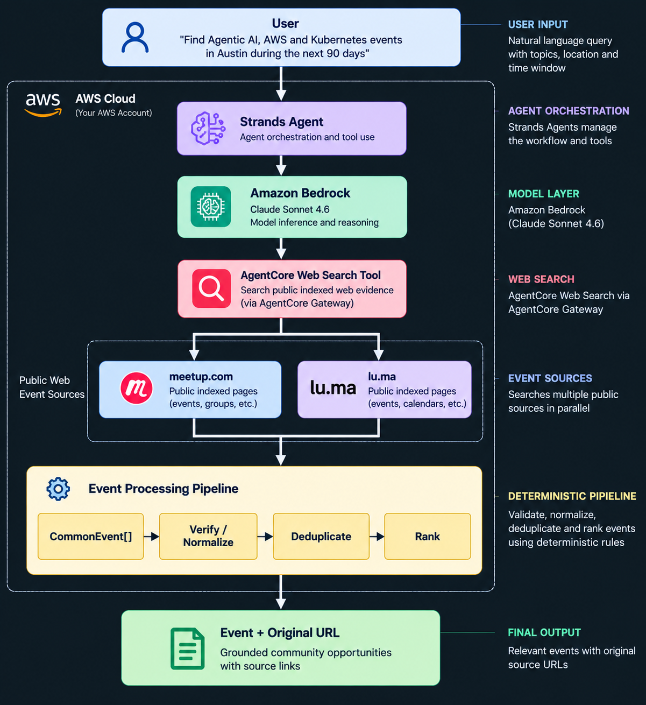
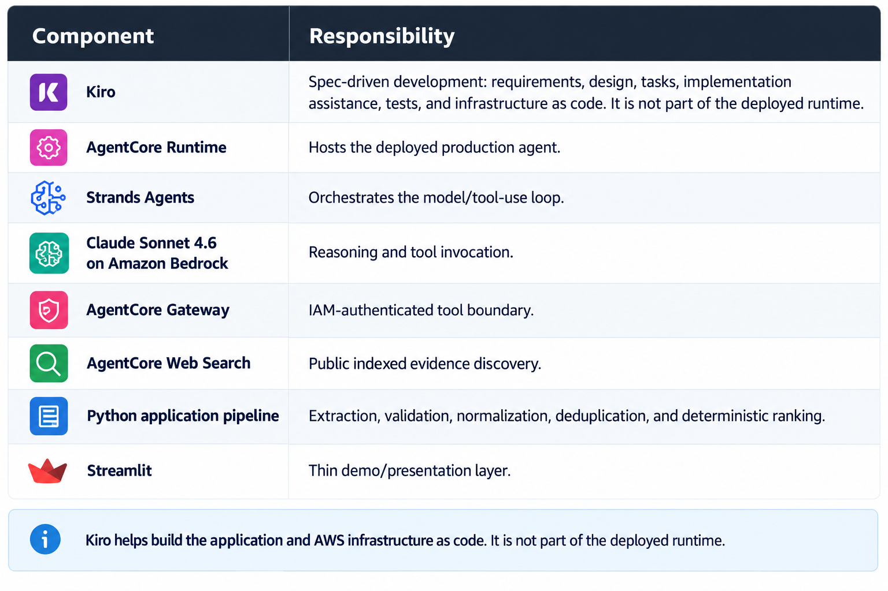

# From Prompt to Opportunity

## Building an AI Community Scout with Amazon Bedrock AgentCore + Kiro

<p align="center">
  
</p>

> **Read the full story:** [From Prompt to Opportunity: Building an AI Community Scout with Amazon Bedrock AgentCore, Strands Agents, and Kiro](https://builder.aws.com/content/3JND7667d3Xq7bqwrqsXgKHTfh4/from-prompt-to-opportunity-building-an-ai-community-scout-with-amazon-bedrock-agentcore-strands-agents-and-kiro) — the companion AWS Builder article.

Community Scout is an AI agent that discovers relevant technology community
opportunities in **Austin, Texas**. Instead of manually searching several event
platforms, you ask a single natural-language question, for example:

> "Find Agentic AI, AWS, and Kubernetes community events in Austin during the next 90 days."

The agent discovers public indexed evidence through Amazon Bedrock AgentCore Web Search,
extracts candidate events from that evidence, validates each candidate for topic
relevance, location (Austin), and date window, normalizes them into a common model,
deduplicates across sources, ranks the survivors deterministically, and returns grounded
results with their original, clickable source URLs.

The model does **not** invent events. Every returned event must be backed by evidence
from the Web Search results, and its source URL is preserved byte-for-byte.

> Kiro helps build the application and the AWS infrastructure as code
> (requirements → design → tasks → implementation → tests → deployment).
> **Kiro is not part of the deployed Runtime.**

---

## Architecture

<p align="center">
  
</p>

Request flow:

1. The user selects topics, location, and time window in the Streamlit UI.
2. Streamlit invokes the Amazon Bedrock AgentCore Runtime.
3. Strands Agents orchestrates Claude Sonnet 4.6 on Amazon Bedrock.
4. AgentCore Gateway provides IAM-authenticated tool access.
5. AgentCore Web Search retrieves public indexed web evidence.
6. The deterministic Python pipeline extracts, validates, normalizes, deduplicates, and
   ranks events.
7. The Runtime returns grounded opportunities with original source URLs.

Kiro assists development and infrastructure-as-code authoring; it does not run inside
AWS.

---

## Evidence-Grounded Discovery

<p align="center">
  
</p>

```text
Web Search
  → Evidence Extraction
    → CommonEvent
      → Verify
        → Normalize
          → Deduplicate
            → Rank
              → Grounded Result
```

Guardrails enforced by the pipeline:

- **Public indexed evidence only** — discovery goes through AgentCore Web Search.
- **No event fabrication** — an event is accepted only if it is supported by evidence.
- **Title from evidence** — the event title is derived from the evidence, not invented.
- **Date from evidence** — the event start date is extracted from the evidence text.
- **Publication date is not the event date** — a page's publish date is never used as
  the event date.
- **Location validation** — the event must be in Austin, Texas.
- **Deterministic date-window filtering** — only events inside the requested
  `[start_date, end_date]` window are kept.
- **Deterministic topic relevance** — the event's own title/description must contain
  credible evidence of a requested topic.
- **Original URLs preserved** — source URLs are preserved byte-for-byte.
- **Deterministic deduplication** — duplicates collapse by a normalized key.
- **Deterministic ranking** — ordering is computed in pure Python, not by the model.
- **Precision over recall** — zero relevant results is preferable to unrelated ones.

AgentCore Web Search is *indexed discovery*, so results are **best-effort** rather than a
guaranteed, complete database of every event.

---

## Component Responsibilities

<p align="center">
  
</p>

| Component | Responsibility |
|---|---|
| Kiro | Spec-driven development: requirements, design, tasks, implementation assistance, tests, and infrastructure as code |
| AgentCore Runtime | Hosts the deployed production agent |
| Strands Agents | Orchestrates the model/tool-use loop |
| Claude Sonnet 4.6 on Amazon Bedrock | Reasoning and tool invocation |
| AgentCore Gateway | IAM-authenticated tool boundary |
| AgentCore Web Search | Public indexed evidence discovery |
| Python application pipeline | Extraction, validation, normalization, deduplication, and deterministic ranking |
| Streamlit | Thin demo/presentation layer |

> Kiro helps build the application and AWS infrastructure as code.
> It is not part of the deployed runtime.

---

## Built with Kiro Spec-Driven Development

```text
Requirements
    ↓
Design
    ↓
Tasks
    ↓
Implementation
    ↓
Tests
    ↓
AWS Deployment
```

The specifications are the engineering source of truth:

- [`.kiro/specs/community-scout-austin/requirements.md`](.kiro/specs/community-scout-austin/requirements.md)
- [`.kiro/specs/community-scout-austin/design.md`](.kiro/specs/community-scout-austin/design.md)
- [`.kiro/specs/community-scout-austin/tasks.md`](.kiro/specs/community-scout-austin/tasks.md)

## Build It with Kiro

The project was built using six focused prompt stages:

1. Define the application and specification
2. Build the evidence-grounded pipeline
3. Connect AgentCore Web Search
4. Build the Strands + Amazon Bedrock agent
5. Deploy to AgentCore Runtime
6. Add the Streamlit UI

[View the complete Kiro prompt sequence](docs/kiro-prompts/README.md)

---

## Repository Structure

```text
.
├── .kiro/specs/community-scout-austin/   # Kiro spec: requirements, design, tasks
├── docs/
│   ├── images/                           # Documentation images
│   └── kiro-prompts/                     # Representative Kiro build prompts
├── src/
│   ├── scout.py                          # AgentCore Runtime handler + agent orchestration
│   ├── config.py                         # Model ID resolution (BEDROCK_MODEL_ID)
│   ├── validation.py                     # Deterministic query/time-window guardrails
│   ├── models/events.py                  # CommonEvent, QueryContext, ToolError models
│   ├── tools/
│   │   ├── agentcore_web_search_event_source.py  # Source-aware Web Search discovery + extraction
│   │   ├── normalizer.py                 # Raw evidence -> CommonEvent normalization
│   │   └── interface.py                  # EventSource protocol
│   └── pipeline/
│       ├── aggregator.py                 # Collect events + tool errors
│       ├── deduplicator.py               # Deterministic cross-source dedup
│       ├── ranker.py                     # Deterministic topic + recency ranking
│       └── response_generator.py         # Grounded Markdown response formatting
├── ui/app.py                             # Streamlit demo UI (invokes the Runtime)
├── tests/                                # unit / integration / property tests
├── infra/cloudformation/                 # Gateway + Runtime CloudFormation templates
├── scripts/                              # package / deploy / run-ui scripts
├── runtime_entrypoint.py                 # Root-level AgentCore direct-code entry point
├── requirements.txt                      # Application/runtime dependencies
└── requirements-ui.txt                   # Streamlit UI dependencies (not shipped to Runtime)
```

---

## Quick Start

Requires Python 3.12+.

```bash
git clone https://github.com/hastimal/bedrock-community-scout.git
cd bedrock-community-scout
python3 -m venv .venv
source .venv/bin/activate
pip install -r requirements.txt
pytest tests/
```

The Bedrock model ID is resolved at runtime from the `BEDROCK_MODEL_ID` environment
variable (see `src/config.py` and `.env.example`). The deployed Runtime is configured to
use **Claude Sonnet 4.6** (`us.anthropic.claude-sonnet-4-6`); any Bedrock model that
supports tool use may be substituted.

---

## Deployment

Infrastructure is defined as CloudFormation in `infra/cloudformation/` (`gateway.yaml`
for the AgentCore Gateway, `runtime.yaml` for the AgentCore Runtime and its
least-privilege execution role).

Deploy the Runtime with:

```bash
./scripts/deploy-runtime.sh
```

Deployment flow:

```text
Application
  → package Runtime ZIP
    → versioned S3 artifact
      → CloudFormation
        → AgentCore Runtime
```

Each deployment uploads the artifact under a **unique, immutable S3 key**
(`community-scout-runtime/<git-sha>-<utc-timestamp>.zip`), so CloudFormation detects the
changed `CodeConfiguration` and creates a new Runtime version instead of silently keeping
the previous code. S3 bucket versioning is enabled and public access is blocked on the
artifact bucket. Region, gateway URL, model ID, and artifact location are parameterized;
no account-specific values are hard-coded here.

---

## Runtime Invocation

Invoke the deployed Runtime directly with the AWS CLI (use your own Runtime ARN and a
runtime session ID of at least 33 characters):

```bash
aws bedrock-agentcore invoke-agent-runtime \
  --agent-runtime-arn "<RUNTIME_ARN>" \
  --runtime-session-id "community-scout-demo-session-0123456789abcdef" \
  --payload '{"prompt":"Find Agentic AI, AWS, and Kubernetes community events in Austin during the next 90 days."}' \
  --cli-binary-format raw-in-base64-out \
  --region us-east-1 \
  runtime-response.json
```

```bash
cat runtime-response.json
```

---

## Streamlit UI

```bash
pip install -r requirements.txt -r requirements-ui.txt
./scripts/run-ui.sh
```

Select topics (**Agentic AI**, **AWS**, **Kubernetes** — all selected by default), with
location fixed to **Austin, Texas** and a **Next 90 days** window, then click **Find
Opportunities**. The UI invokes the deployed AgentCore Runtime and renders the grounded
Markdown response with clickable original URLs. It is a thin presentation layer and is
**not** the event-processing engine — it performs no searching, extraction, ranking, or
deduplication itself. It uses the standard AWS credential chain and can be configured
with `AWS_REGION` and `AGENTCORE_RUNTIME_ARN`.

---

## Testing

```bash
pytest tests/
```

- **Unit** (`tests/unit/`) — CommonEvent model, normalization, Meetup date extraction,
  group-page title association, topic-relevance gate, source-aware discovery, Web Search
  response parsing, MCP transport wiring, scout orchestration, UI response decoding, and
  discovery diagnostics.
- **Integration** (`tests/integration/`) — end-to-end pipeline, AgentCore tool timeout
  handling, and zero-results behavior.
- **Property** (`tests/property/`) — URL immutability, normalization invariants,
  time-window filtering, and tool-failure containment.

Tested behaviors include date filtering, topic relevance, source-aware discovery,
normalization, deduplication, byte-for-byte URL preservation, Runtime/UI response
decoding, discovery diagnostics, and the end-to-end pipeline.

Current status: **203 tests passing** (run `pytest tests/` to reproduce).

---

## Security

- **IAM / SigV4 Gateway authentication** — the AgentCore Gateway uses AWS IAM (SigV4)
  authorization; the Runtime invokes it with a scoped `bedrock-agentcore:InvokeGateway`
  permission.
- **Least-privilege Runtime execution role** — grants only Bedrock model invocation for
  the configured model, `InvokeGateway` on the specific gateway, scoped CloudWatch Logs,
  scoped observability, and read of the specific S3 code artifact; it uses neither
  `AdministratorAccess` nor `BedrockAgentCoreFullAccess` and includes confused-deputy
  protection (`aws:SourceAccount` / `aws:SourceArn`).
- **No credentials committed** — AWS credentials are resolved from the standard
  credential chain; none are stored in the repository.
- **S3 public access blocked** on the Runtime artifact bucket.
- **S3 versioning enabled** on the artifact bucket.
- **Credential-safe diagnostics** — discovery diagnostic logging emits only
  search/discovery evidence (titles, URLs, snippets, counts), never credentials,
  headers, tokens, or signatures.

---

## Limitations

- Indexed Web Search discovery is **best-effort**.
- Source coverage varies between queries and over time.
- Meetup/Luma support does not guarantee both sources appear in any given result set.
- Extraction quality depends on the available indexed evidence.
- **Austin, Texas is the current MVP location** (fixed in code).
- Community Scout is an opportunity discovery assistant, **not a comprehensive event
  database**.

---

## Roadmap

Future work (not yet implemented):

- Additional cities
- Additional community/event sources
- CFP / Call for Speakers discovery
- Conferences and workshops
- Hackathon judging opportunities
- Improved event-detail extraction
- Evidence-quality scoring
- OpenTelemetry observability
- Scheduled opportunity alerts

---

## Authors

**Hastimal Jangid**

Cloud, Data & AI Architect | Researcher | Technical Speaker
Co-Founder, RankRabbit.AI

- GitHub: https://github.com/hastimal
- LinkedIn: https://www.linkedin.com/in/hastimaljangid/
- Website: https://hastimal.github.io/

**Harsh Jangid**

Data & Product | Author & Speaker
Co-Founder, RankRabbit.AI

- LinkedIn: https://www.linkedin.com/in/harsh-jangid/
